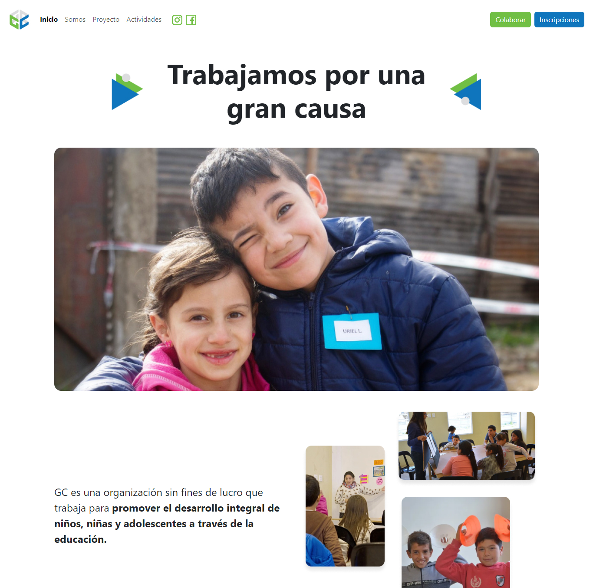

# PROYECTO INTEGRADOR NIVEL 1 - Web Institucional

## 📌 Introducción y resumen del proyecto

Este proyecto es un sitio web institucional desarrollado como desafío integrador (nivel 1) del Bootcamp Java Developer de [EducaciónIT](https://www.educacionit.com/bootcamp-java-developer) en conjunto con el [Centro Universitario de Vicente López](https://www.vicentelopez.gov.ar/centrouniversitariovl).

El objetivo de este desafío es poner en práctica los conocimientos adquiridos durante la primer parte del Bootcamp que contempla una formación en tecnologías como: HTML, CSS, JavaScript, GIT, GitHub y Bootstrap.

Para completar el desafío se solicitó:

- Generar un sitio web institucional con un diseño personalizado
- Utilizar Bootstrap como librería de estilos para el maquetado de la web
- Generar animaciones para distintas páginas del sitio web
- Generar validaciones con JavaScript para todos los formularios
- Implementar una librería o código propio para desarrollar un carrousel de imágenes en la sección actividades
- Almacenar el código fuente y sus versiones utilizando GIT y GitHub
- Hostear el sitio terminado utilizando GitHub pages

 

## 🚀 Deploy

Pueden acceder al sitio desde: [este link](https://florluzduarte.github.io/integrador-nivel-1-bootcamp-java/)

## 💼 Mi rol en el proyecto

- Frontend Developer

## 🔨 Tecnologías utilizadas

`HTML` --> Para la estructura  
`CSS` --> Para los estilos  
`JavaScript` --> Como lenguaje de programación  
`Bootstrap` --> Como librería de estilos  
`Flickity` --> Como librería para el carrousel de imágenes  
`GIT y GitHub` --> Para gestionar el versionado de código  
`GitHub Pages` --> Para hostear el proyecto final  
`Figma` --> Para realizar diseños y prototipos
